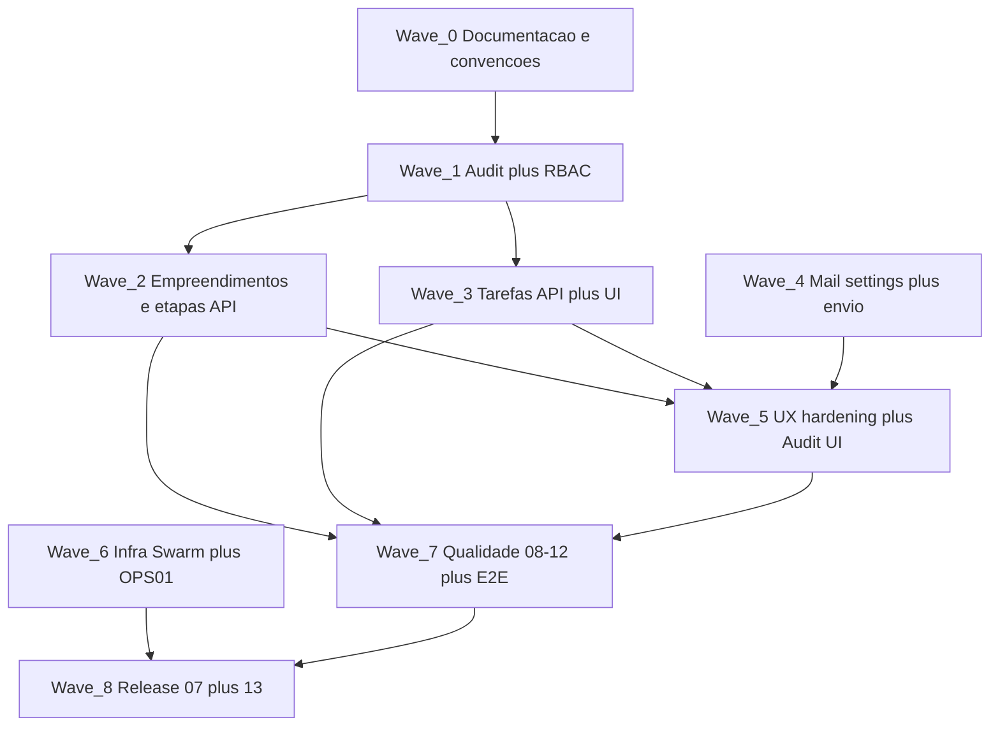

# Roadmap de finalização — Incorporação (Diga Olá)

> **Propósito:** complementar [docs/06_SPECIFICATION.md](06_SPECIFICATION.md) e [docs/DOCS_INDEX.md](DOCS_INDEX.md) com um plano operacional **mais granular**: o que falta, em que ordem, com **critérios de aceitação**, **dependências**, **riscos** e **gates** até release.  
> **Última atualização:** 15/04/2026

---

## 1. Norte e critérios de sucesso (produto)

Alinhado a [docs/01_PRD.md](01_PRD.md):

- **Paridade:** motor de pesos e % de avanço auditável e consistente com a planilha de referência (tolerância já usada no seed: ±0,01 no piloto FIT LAGO AZUL).
- **Substituição da planilha:** o sistema só “fecha” a migração quando houver **paridade validada** em pelo menos **um empreendimento piloto** e **owner de negócio** a assinar a descontinuação da edição no Excel (bloqueio explícito na [spec §2](06_SPECIFICATION.md)).
- **Operação diária:** perfis leitura/edição/admin, **Minhas tarefas** fiéis ao responsável, **auditoria** em mudanças sensíveis.
- **Fora de escopo** (não entrar no roadmap): monetização/Stripe, ERP, multi-tenant, N5 notificações (pós-go-live), app nativo — ver PRD §3.

---

## 2. Estado atual (snapshot técnico)

**Já entregue (resumo):**

- Modelo de dados e seed (9 empreendimentos, 22 etapas, paridade FIT LAGO AZUL).
- Domínio: [src/lib/domain/progress.ts](../src/lib/domain/progress.ts), [src/lib/domain/permissions.ts](../src/lib/domain/permissions.ts).
- Auth: sessão cookie + bcrypt + rotas `/api/auth/login|logout|me`; middleware protege `/(app)` e APIs.
- Leitura: dashboard e lista com dados reais; painel por `slug`; `GET /api/developments`, `GET /api/developments/[slug]`.
- **Não entregue ou parcial:** CRUD completo empreendimentos; API de **mutação** de status de etapa; CRUD tarefas + `/api/tasks/my`; serviço **audit** aplicado nas mutações; **RBAC 403** em todos os handlers de escrita; módulo **e-mail** (settings + envio); **docker/stack** operacional; documentos **07_IMPLEMENTATION** (raiz `docs/`) e preenchimento total **08–13**; [docs/03_RESEARCH.md](03_RESEARCH.md) pendente no DOCS_INDEX.

**Dívida de convenção:** a spec cita `api/developments/[id]/stages`; o app usa **`slug`** nas URLs de UI e em parte das APIs — o roadmap assume **padronizar em `slug`** nos route handlers novos (ou documentar ADR se mantiver `cuid` em algum endpoint interno).

---

## 3. Matriz RF → estado → próximo passo

| RF | Requisito | Estado | Próximo passo |
|----|-----------|--------|----------------|
| RF-01 | Empreendimentos CRUD + soft delete | Leitura OK; escrita ausente | POST/PATCH/DELETE (ou patch isActive) + Zod + testes |
| RF-02/03 | Etapas e pesos | Motor OK | API PATCH status por etapa + eventual UI inline/select |
| RF-04/05 | Status e avanço agregado | OK em leitura | Revalidar após cada mutação (mesma função de domínio) |
| RF-06 | Tarefas CRUD | UI parcial/mock histórico | Rotas + validações + forms |
| RF-07 | Painel empreendimento | Leitura real | Ligar ações “Nova tarefa”, edição de etapa quando API existir |
| RF-08 | Minhas tarefas | Página existe; dados mock | `GET /api/tasks/my` + query só `assigneeId` + testes authz |
| RF-09 | Dashboard geral | Dados reais | Opcional: otimização/query única; teste consistência |
| RF-10 | Auth + RBAC | Sessão OK | 403 sistemático em mutações VIEWER; admin em settings |
| RF-11 | Auditoria | Modelo Prisma | Serviço append-only + chamadas em cada mutação crítica |
| RF-12 | Carga inicial | Seed OK | Manter ao evoluir tarefas/campos |

---

## 4. Waves (fases internas) e dependências

- **Wave 0 (rápida):** criar [docs/07_IMPLEMENTATION.md](07_IMPLEMENTATION.md) a partir do template; alinhar [ARCHITECTURE.md](../ARCHITECTURE.md) à árvore real; decidir **slug vs id** nos paths da API (ADR de uma página se necessário).
- **Wave 1:** sem dependência de novas features — base para confiança e compliance.
- **Waves 2 e 3** podem avançar em **paralelo** depois de Wave 1 (duas frentes: domínio empreendimento/etapa vs tarefas), com acordo nos contratos JSON e nos tipos em [src/types/](..%2Fsrc%2Ftypes).
- **Wave 4** depende de decisão SMTP OAuth2 vs Graph ([spec §2 bloqueio](06_SPECIFICATION.md)); [docs/03_RESEARCH.md](03_RESEARCH.md) pode ser fechada antes ou em paralelo à implementação mínima.
- **Wave 5** agrega: estados loading/empty/error, página [audit](..%2Fsrc%2Fapp%2F(app)%2Faudit%2Fpage.tsx) com dados reais, settings de utilizadores se previsto no PRD.
- **Wave 6** pode começar em paralelo ao fim da Wave 3 se houver ambiente de homologação.

---

## 5. Waves detalhadas (entregáveis e DoD)

### Wave 0 — Documentação e convenções

- **Entregáveis:** `docs/07_IMPLEMENTATION.md` com slices concluídos e comandos; atualização `ARCHITECTURE.md` (Next 16, auth real, pastas `src/lib/services`, etc.); nota no rodapé da spec ou ADR sobre **`[slug]`** nas rotas API.
- **DoD:** `bash scripts/verify-docs.sh` verde; DOCS_INDEX coerente (opcional: marcar 03_RESEARCH como N/A ou preenchido).

### Wave 1 — Auditoria + RBAC defensivo

- **Entregáveis:** [src/lib/audit/audit-log.service.ts](../src/lib/audit/audit-log.service.ts) (ou equivalente); helpers que recebem `userId`, `entity`, `action`, `old/new` sem PII em excesso; uso em **todas** as mutações futuras; testes: VIEWER → 403 em POST/PATCH relevantes (mocks ou HTTP integração).
- **DoD:** lista explícita de operações auditadas; nenhuma rota de escrita sem checagem de role.
- **Estado (15/04/2026):** serviço `appendAuditLog`, `requireEditorForApi`, `PATCH /api/developments/[slug]/stages` com transação + auditoria; testes unitários de `permissions.ts`. Próximo: aplicar o mesmo padrão às mutações de tarefas/empreendimentos e testes HTTP 403.

### Wave 2 — Empreendimentos e etapas (escrita)

- **Entregáveis:** contratos Zod; `POST/PATCH` empreendimentos; `PATCH` status `DevelopmentStage` por `developmentSlug` + `stageId` (ou body); invalidação/re-fetch do painel.
- **DoD:** testes integração felizes + 404/422; progresso recalculado igual ao motor de domínio.

### Wave 3 — Tarefas

- **Entregáveis:** [src/lib/validations/task.ts](../src/lib/validations/task.ts); rotas tasks + `my`; UI tarefas e formulário “Nova tarefa” no painel; ordenação por prazo e badge vencido coerente com API.
- **DoD:** utilizador A não vê tarefas de B em “Minhas tarefas”; seed opcional com poucas tarefas de exemplo para demo.

### Wave 4 — E-mail (Microsoft 365)

- **Entregáveis:** settings cifrados, máscara na API, admin-only; `mail/test` e `mail/send` com throttling básico; dependências (`nodemailer` / Azure conforme decisão).
- **DoD:** auditoria em alteração de config e em envio; segredo nunca retornado em claro.

### Wave 5 — UX e superfícies restantes

- **Entregáveis:** skeletons/empty/error nas páginas críticas; lista de auditoria legível (filtros mínimos); **registo**: alinhar PRD — se apenas admin cria utilizadores, desativar ou proteger `/register`.
- **DoD:** checklist da spec §4 (estados) verificada por página crítica.

### Wave 6 — Infra

- **Entregáveis:** `docker/stack.yml` alinhado a [docs/OPS01_DEPLOYMENT.md](OPS01_DEPLOYMENT.md); healthcheck; variáveis documentadas em `.env.example`.
- **DoD:** deploy de homologação documentado passo a passo; rollback descrito (spec §13).

### Wave 7 — Qualidade (Fase 4)

- **Entregáveis:** preencher [docs/08_SECURITY.md](08_SECURITY.md) … [docs/12_THREAT_MODEL.md](12_THREAT_MODEL.md); E2E mínimos da spec §12; `npm run test` e `npm run test:e2e` na CI se aplicável.
- **DoD:** vereditos nos docs; sem vulnerabilidade crítica não aceite; ameaças e controlos mapeados.

### Wave 8 — Release

- **Entregáveis:** [docs/13_RELEASE_READINESS.md](13_RELEASE_READINESS.md) com GO / GO WITH RISK / NO-GO; [docs/07_IMPLEMENTATION.md](07_IMPLEMENTATION.md) final; atualizar [docs/DOCS_INDEX.md](DOCS_INDEX.md).
- **DoD:** critério PRD de piloto e assinatura owner para “desligar Excel” registado como decisão de go-live (mesmo que data TBD).

---

## 6. Priorização sugerida (MoSCoW)

- **Must have (bloqueiam release):** Waves 1–3, 7 (mínimo segurança + testes + threat), 8, paridade piloto acordada.
- **Should have:** Wave 2 completo (inclui gestão empreendimentos se operação exigir), Wave 5 estados UX, auditoria **legível** na UI.
- **Could have:** Wave 4 e-mail **se** o processo de aprovação corporativa depender do app no dia 1; caso contrário ADR “e-mail fase 1.1” e scope reduzido.
- **Won’t have (agora):** N1–N8 PRD; Stripe; Sienge.

---

## 7. Riscos e mitigação

| Risco | Impacto | Mitigação |
|-------|---------|-----------|
| OAuth/Graph mal escolhido | Atraso Wave 4 | Fechar [03_RESEARCH.md](03_RESEARCH.md) ou ADR; baseline SMTP OAuth2 na spec |
| Paridade % divergente após edições | Confiança zero | Testes com fixtures FIT LAGO + segundo empreendimento; revisão owner |
| Registo aberto | Acesso indevido | PRD + middleware: só convite/admin |
| Scope creep em “auditoria perfeita” | Atraso | MVP: append-only + lista; export avançado depois |
| Falta de 07_IMPLEMENTATION | Perda de operação | Wave 0 obrigatória antes do GO |

---

## 8. Gates entre waves (checklist rápido)

Antes de avançar:

- [ ] `typecheck` + `lint` verdes no escopo tocado.
- [ ] Testes novos ou atualizados para o RF afetado.
- [ ] Trecho relevante em `07_IMPLEMENTATION` atualizado.
- [ ] Se mudança de contrato API: mencionar em spec ou ADR.
- [ ] `verify-docs.sh` antes de marcar fase fechada no DOCS_INDEX.

---

## 9. Paralelização recomendada (duas frentes)

Depois da **Wave 1**:

- **Frente A (domínio obra):** Wave 2 → integração painel (edição etapa).
- **Frente B (tarefas):** Wave 3.

Sincronizar em **reuniões de contrato** leves: tipos TypeScript partilhados, convenção de erros JSON (`{ error: string }` + código), e idempotência do seed.

---

## 10. Referência aos slices da spec

Continuidade com [docs/06_SPECIFICATION.md §11](06_SPECIFICATION.md):

| Slice spec | Onde no roadmap |
|------------|-----------------|
| Slice 1 — domínio + seed | Feito; manter ao adicionar campos |
| Slice 2 — auth, RBAC, auditoria | Wave 1 (+ completar RBAC) |
| Slice 3 — dashboard + painel | Feito leitura; Wave 2–3 completam ações |
| Slice 4 — tarefas | Wave 3 |
| Slice 5 — e-mail | Wave 4 |
| Slice 6 — deploy Swarm | Wave 6 |

---

## 11. Próximo passo imediato (ordem de execução sugerida)

1. **Wave 0** (documentação + convenção slug) — meio dia a 1 dia.
2. **Wave 1** (audit + testes 403) — 2–4 dias conforme cobertura.
3. Em paralelo planeado: **Wave 2** e **Wave 3** com developer A / B ou sequencial se equipa única.

Este ficheiro deve ser revisto ao concluir cada wave (data e notas no rodapé).
